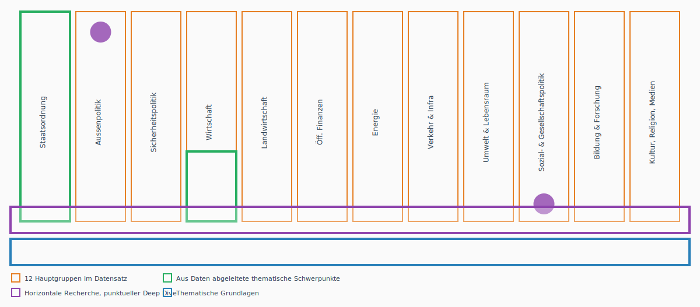
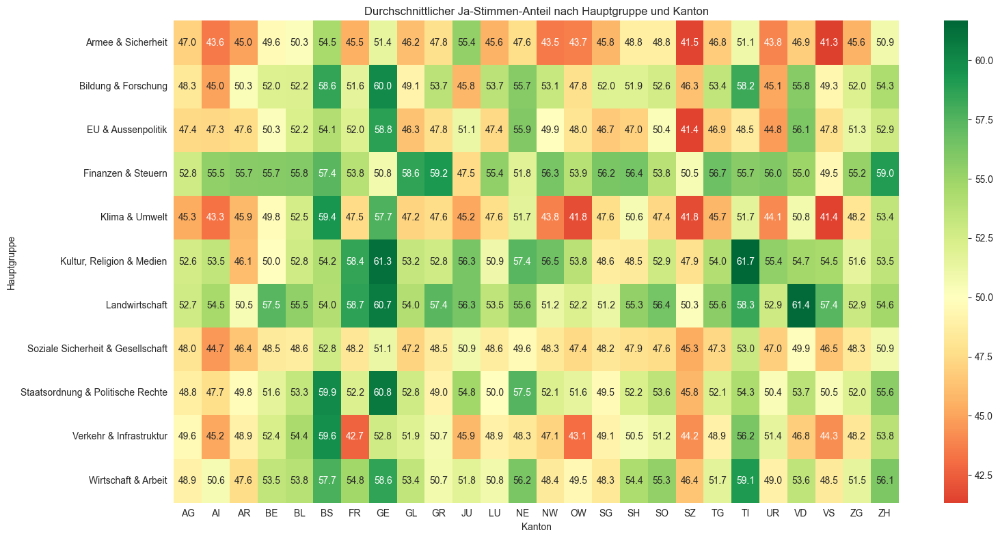

# Project Pitch: Direkte Demokratie 

**Students:** Manuel Emmenegger, Theresa Olfogo, Charlotte Schwegler  
**Project Title:** Die Schweizer Bevölkerung - eine Herde Schafe?

## Project Goal & Research Questions 

Inwiefern stimmen die Abstimmungsempfehlungen von Bundesrat, Parlament und den grossen Parteien mit der Meinung der Bevölkerung überein.

### Einleitung 

- Was ist direkte Demokratie?
- Direktdemokratische Mittel
- Erläuterung Fragestellung

### Methodologie 

- Datensatz/Datensätze (Horizontale Recherche & punktueller Deep Dive)
- Variabeln 
- Untersuchungszeitraum begründen (1970-2025, Kontinuität Daten)
- Entwickelte Einigkeitsskala erläutern

### Analyse 

- Zeitliche Achse:  Regierungskonformitätswerte über Zeit nach Vorlagentyp (obligatorisches Referendum, fakultatives Referendum, Volksinitiative) 
- Thematische Achse: Regierungskonformitätswerte über Themen nach Vorlagentyp (obligatorisches Referendum, fakultatives Referendum, Volksinitiative)
- Anwendung Einigkeitsskala

Die vorliegende Grafik zeigt das Vorgehen bei der Analyse auf, nach erfolgter thematischer Recherche und Grundlagearbeit findet eine horizontale Analyse mit einzelnen Deep Dives statt. Die einzelnen Deep Dives, dargestellt als violette Punkte, dienen einer stichprobenartigen Prüfung der horizontalen Analyse. Die horizontale Analyse dient der Untersuchung der zeitlichen Achse sowie der Definition der thematischen Schwerpunkte, wobei jeweils die Haupgruppen mit grösster und kleinster Einigkeit im Zentrum stehen.

Bonus: Geografische Achse wird erarbeitet, sofern Relevanz während Projektverlauf erkannt wird.

### Abgleich mit VOX/TOTO 

- Decken sich unsere Findings?
- Thematischer Deep Dive, sofern Relevanz während Projektverlauf erkannt wird.

### Diskussion und Fazit 

- Fragestellung beantworten
- Limitation des Ansatzes/Modells 
- Ausblick/Zukünftiges Forschungspotenzial 

## Data Sources and Literature Review 

### Literatur 

Bauer, P. C., Freitag, M. & Sciarini, P. (2019). Political trust in Switzerland: Again a special case? In J. Jedwab & J. Kincaid (Hrsg.), Identities, trust, and cohesion in federal systems: Public perspectives (S. 115–145). McGill-Queen's University Press. 

Freitag, M. & Vatter, A. (Hrsg.). (2015). Wahlen und Wählerschaft in der Schweiz. NZZ Libro. 

Kriesi, H. (2005). Direct democratic choice: The Swiss experience. Lexington Books. 

Milic, T., Rousselot, B. & Vatter, A. (2014). Handbuch der Abstimmungsforschung. NZZ Libro. 

OECD. (2024). OECD survey on drivers of trust in public institutions 2024: Country notes Switzerland. OECD Publishing. https://www.oecd.org/en/publications/oecd-survey-on-drivers-of-trust-in-public-institutions-2024-results-country-notes_a8004759-en/switzerland_b0df7353-en.html 

Sciarini, P. (2024, 5. November). Volksabstimmung: Barometer des Vertrauens. Die Volkswirtschaft. https://dievolkswirtschaft.ch/de/2024/11/volksabstimmung-barometer-des-vertrauens/  

Vatter, A. (2020). Der Bundesrat: Die Schweizer Regierung. NZZ Libro. 

Datensets 

VOX-Analysen eidgenössischer Urnengänge: Befragung von Stimmberechtigten nach eidgenössischen Abstimmungen von 1981 bis 2016; 2020 bis letzte Abstimmung. https://www.swissubase.ch/de/catalogue/studies/225/21298/overview 

## Data Visualization 
Der vorliegende Datensatz enthält 708 Beobachtungen im Zeitraum von 1848 bis 2026. Die einzelnen Beobachtungen sind in 12 Haupgruppen unterteilt, wobei sich die beiden Themengebiete Staatsordnung sowie Sozial- und Gesellschaftspolitik in der Anzahl der Beobachtungen klar abheben und gemeinsam rund 60% der Beobachtungen ausmachen. Dies entspricht rund dem fünffachen Anteil der Beobachtungen in den drei Themengebieten Energie, Bildung Forschung und Kultur, Religion, Medien, welche jeweils rund 13% der Beobachtungen ausmachen. Die Beobachtungen der beiden Kategorien Umwelt und Lebensraum sowie Energie wurden aufgrund weniger Beobachtungen in den nachfolgenden Grafiken zur Kategorie Klima und Umwelt zusammengefasst.

Gemäss ersten Auswertungen folgt das Volk bei Themen der Staatsordnung und Aussenpolitik weniger den Empfehlungen des Bundesrats. Wichtig in diesem Zusammenhang ist die Tatsache, dass gerade im Bereich Klima & Umwelt nicht gleich viel Daten vorliegen, wie bei der Staatsordnung. Für die vorliegende Arbeit wird es ausserdem relevant sein, die Initiativen und Referenden konkret zu untersuchen und grafisch zu unterscheiden.

Aus den Daten geht hervor, dass die Initiativen über lange Zeiträume komplett angenommen wurden. Mit Quervergleichen in den Daten konnte jedoch festgestellt werden, dass ein Fehler in der Abstufung der Grafik vorliegen muss. Es gab durchaus Differenzen besondern in den Jahren zwischen 1950 und 1970.

Die kantonale Treue zu den Empfehlungen des Bundesrats scheint vor allem beim Kanton Schwyz einen Ausreisser zu beinhalten. Weiter ist die Sprachregion deutlicher zu differenzieren, da gerade Grenzkantone sicherlich ein diffuseres Bild abgeben und der Röstigraben nicht an den Kantonsgrenzen entlang läuft.

Aus den Visualisierungen geht aktuell eine Überraschung hervor, dass zum Beispiel Basel Stadt in Themen von Armee und Sicherheit eher der Empfehlung des Bundesrats folgt. Solche kantonale Ausreisser sind konkret zu untersuchen, da gerade Basel Stadt eher für seine linksgrüne Politik bekannt ist und daher mutmasslich eher weniger den Empfehlungen des Bundesrats folgt.
